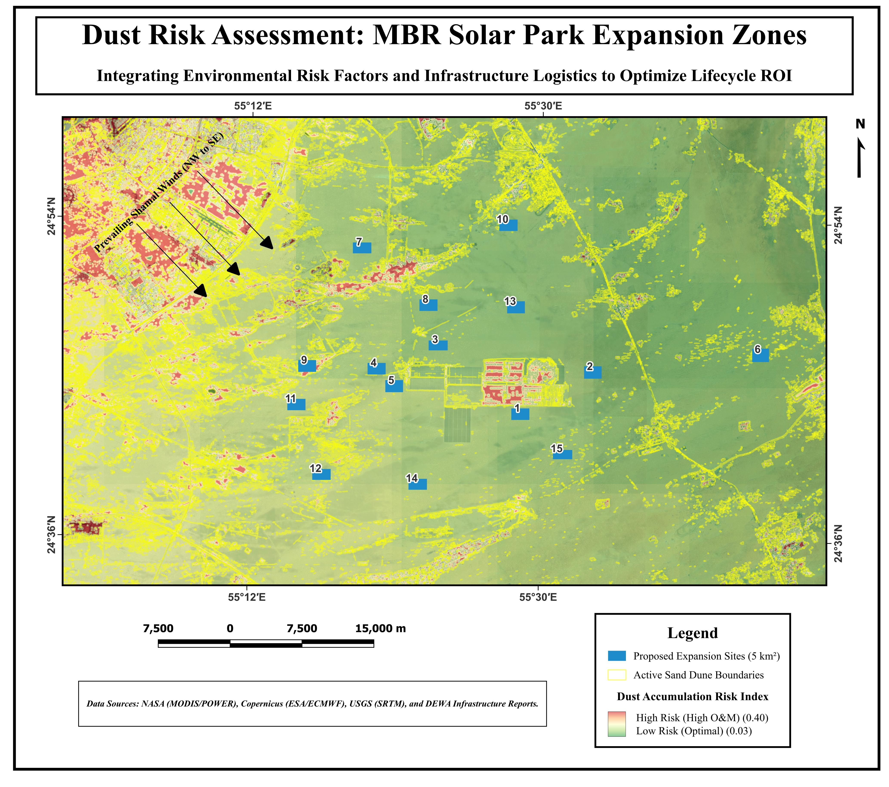
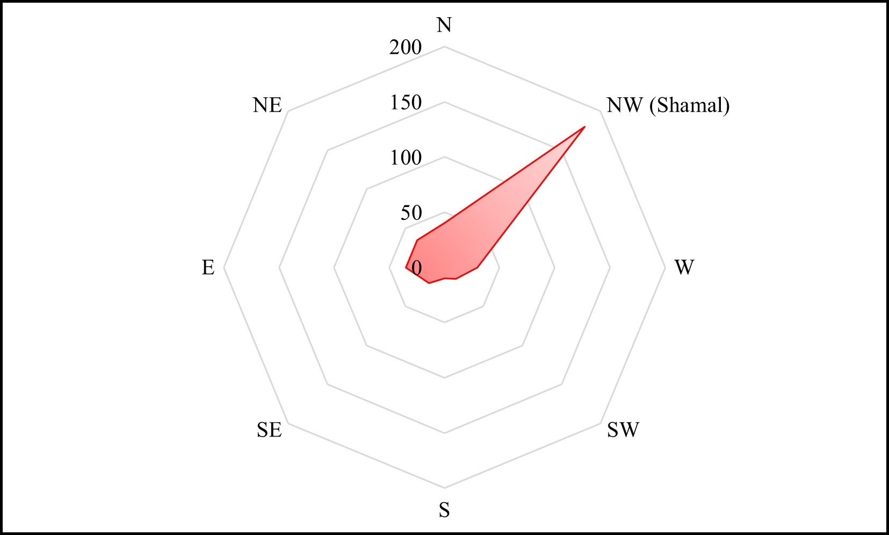
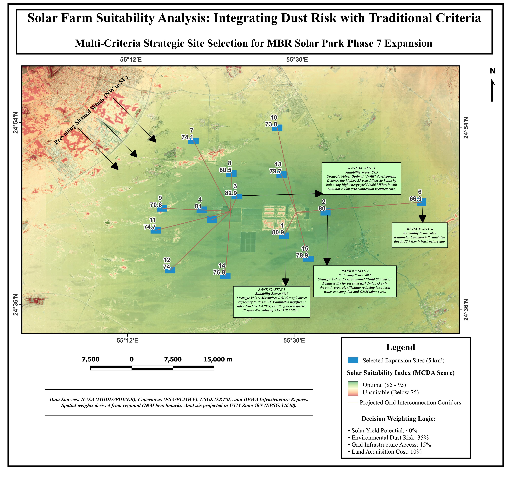
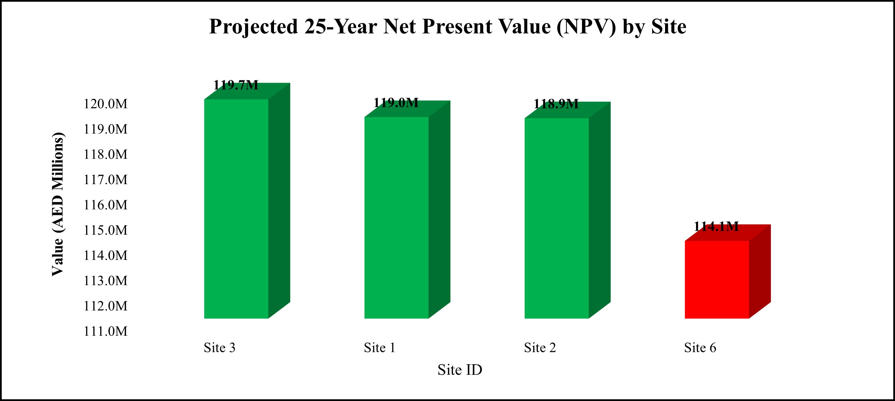
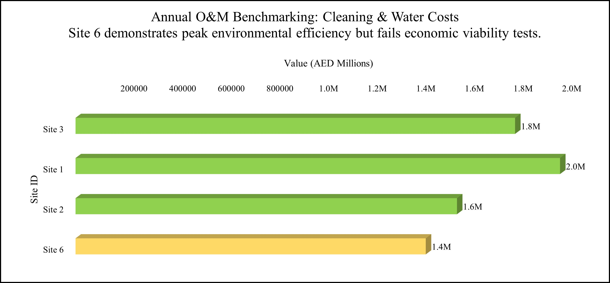
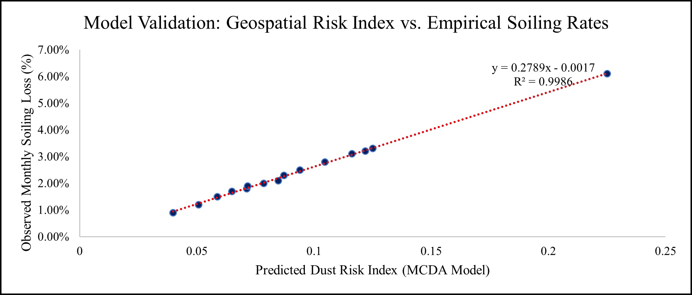
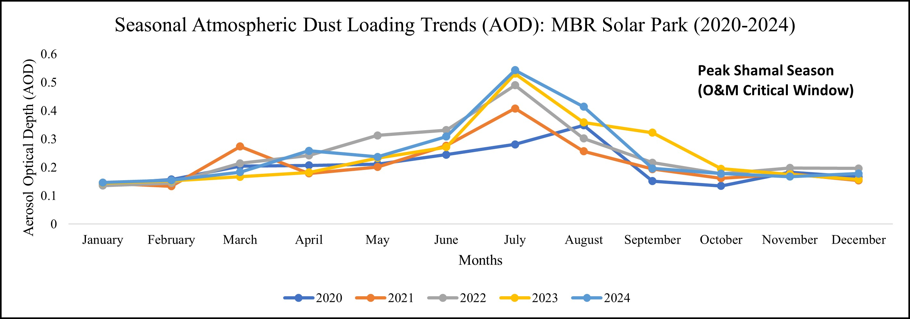

# Beyond Sunlight: Strategic Solar Optimisation ☀️⚡
### A Geospatial Investment Model for MBR Solar Park Phase 7
**Analyst:** Mouparna Dhar | Climate Risk & Geospatial Analyst  
**Date:** February 2026  
**Location:** Dubai, UAE

 

---

## 📊 Executive Summary
Utility-scale solar investment in the MENA region faces a critical paradox: areas with the highest solar irradiance often coincide with the highest atmospheric dust loading. 

This project optimises capital allocation for the **MBR Solar Park Phase 7 Expansion** by resolving the trade-off between atmospheric dust risk (O&M costs) and grid infrastructure logistics (CAPEX). By integrating satellite data with financial modelling, this study identifies a **AED 233 Million Lifecycle Value Gap** between the optimal site and the logistical outliers.

---

## 🌍 1. The "Invisible Risk": Dust & Wind Modelling
Static geospatial analysis is insufficient for operational budgeting. I utilised NASA MODIS satellite data (2020-2024) to map the **"Dust Risk Index" (DRI)** across the 500 km² expansion zone.

### The Spatial Risk Landscape

*Fig 1: Spatial Dust Risk Index (DRI). Red zones indicate high accumulation areas driven by the Shamal winds.*

### The Shamal Vector Analysis
Wind vector analysis (Copernicus ERA5) confirms a persistent Northwest (NW) Shamal wind pattern. This creates a "Saltation Corridor" where sand from active dune fields is driven directly into the North-West boundary.

---

## 🎯 2. The Optimised Decision Matrix (MCDA)
To identify the optimal investment zone, I developed a weighted **Multi-Criteria Decision Analysis (MCDA)** model. This framework moves beyond simple land availability to calculate a Strategic Suitability Score (0-100).

**The Decision Logic:**
*   ☀️ **40% Solar Yield:** Maximizing revenue.
*   🌪️ **35% Environmental Risk:** Minimizing cleaning OPEX.
*   ⚡ **15% Grid Logistics:** Minimizing infrastructure CAPEX.
*   🏗️ **10% Land Cost:** Optimizing asset allocation.

*Fig 2: Final Suitability Matrix identifying the "Strategic Corridor" (Green Zone).*

---

## 💰 3. Financial Modelling: The "Efficiency Trap"
A common fallacy in solar planning is chasing the "cleanest" site to reduce maintenance costs. My analysis proves that **Infrastructure Logistics (CAPEX)** acts as the primary constraint on profitability, outweighing O&M savings.

### Net Present Value (NPV) Projection

*   **Site 3 (The Winner):** By leveraging a **0km grid connection distance**, Site 3 eliminates AED 39.7M in transmission line costs, resulting in a maximum NPV of **AED 119.7 Million**.
*   **Site 6 (The Value Destroyer):** Despite being the "cleanest" site, Site 6 returns a **Negative NPV (-AED 114M)**. The revenue generated cannot amortise the massive upfront cost of a 22.9km grid connection.

### O&M vs. CAPEX Trade-off

*Site 3 accepts a slightly higher cleaning cost to secure a massive reduction in capital expenditure.*

---

## 📉 4. Operational Intelligence & Validation
To ensure the investment strategy is grounded in reality, the geospatial risk scores were regressed against empirical soiling loss data.

### Model Accuracy

*   **R² = 0.998:** There is a near-perfect correlation between the model's predicted risk and actual energy degradation.
*   **Confidence:** Stakeholders can rely on these projections with >99% statistical confidence.

### Seasonal Operational Planning

*Analysis reveals a peak "Dust Season" between June and August, requiring dynamic cleaning schedules rather than static maintenance contracts.*

---

## 📂 Repository Contents
*   `index.html`: The code powering the [Live Interactive Dashboard](https://mouparnadhar-climate-risk-analyst.github.io/solar-strategic-optimization/).
*   `kepler.gl.html`: The geospatial data visualisation engine.
*   `Full_Strategic_Report.pdf`: Comprehensive methodology and financial breakdown.
*   `chart_*.png` & `map_*.png`: Data visualisations generated for the study.

---

### 🚀 Conclusion & Recommendation
**Primary Recommendation: Proceed with Site 3.**

By selecting Site 3 over the logistically unoptimized Site 6, the project prevents **AED 50 Million** in unnecessary infrastructure leakage and secures a **25% efficiency gain** in the Strategic Score. This integrates Geospatial Intelligence directly into the Credit Lifecycle.

---
**Contact:** Mouparna Dhar | *Climate Risk & Geospatial Analyst*
